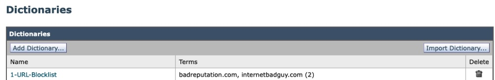
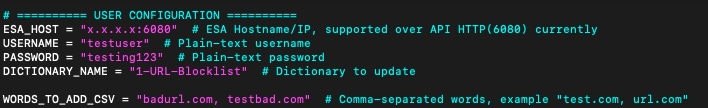
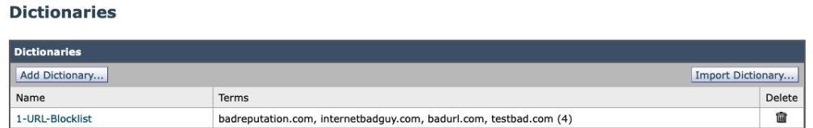
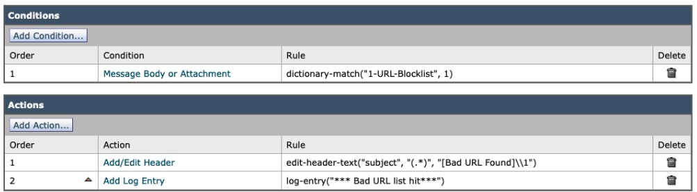
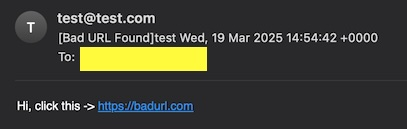

# ESA API Automation Script

## Overview

This Python script automates interactions with the Cisco Email Security Appliance (ESA) API, allowing users to:

- Authenticate and retrieve a JWT token
- Fetch available dictionaries
- Add words to a specified dictionary

## Features

- Base64 Encoding: Automatically encodes username and password.
- Customizable Inputs: User-configurable ESA hostname, credentials, dictionary name, and words.
- CSV-style Input for Words: Words can be provided in a simple comma-separated format.
- Handles HTTP 200 & 201 as Success: Ensures API requests are validated correctly.

## Installation

Prerequisites

- Python 3.x
- `requests` library (install using `pip install requests`)

Setup

1. Clone the repository:
```
git clone https://github.com/ciscoketcheon/ESA-API-BULK-URL.git
cd ESA-API-BULK-URL
```
2. Install dependencies:
```
pip install requests
```
## Configuration

Modify the following variables in the script before running:
```
# ========== USER CONFIGURATION ==========
ESA_HOST = "x.x.x.x:6080"  # ESA Hostname/IP
USERNAME = "user"  # Plain-text username
PASSWORD = "password"  # Plain-text password
DICTIONARY_NAME = "mydictionary"  # Dictionary to update

WORDS_TO_ADD_CSV = "url1.com, testing.com"  # Comma-separated words
```
- `ESA_HOST`: The IP address or hostname of your ESA.
- `USERNAME`: ESA API username (will be Base64-encoded automatically).
- `PASSWORD`: ESA API password (will be Base64-encoded automatically).
- `DICTIONARY_NAME`: The name of the dictionary you want to update.
- `WORDS_TO_ADD_CSV`: Words to add in a comma-separated format.
  - Format: word or word:score:option (e.g., *credit:2:prefix).

## Usage

Run the script

Execute the script with:
```
python bulk_url.py
```
Example Output
```
Attempting login with encoded credentials...
Login successful!
Successfully added words to mydictionary
```
## Troubleshooting

Invalid Credentials

- Ensure you have the correct username/password.
- Manually verify Base64 encoding with:
```
echo -n "your-username" | base64
echo -n "your-password" | base64
```
Connection Issues

- Check network access to ESA_HOST.
- Verify ESA API service is running.

Debugging API Responses

If unexpected errors occur, inspect the API responses in the script output.


## How do I know it works?

Example dictionary of "1-URL-Blocklist" in ESA, create one and update dictionary name in the script


Configure script



Run the script
```
$ python3 bulk_url.py 
Attempting login with encoded credentials...
Login successful!
Successfully added words to 1-URL-Blocklist
```

Check back the dictionary on ESA, it's updated.


Further email test, sample content filter to match URL in the dictionary, and modify subject and add custom log:-


Send a test email containing the URL, example of using `swaks`:-
```
$ swaks --server x.x.x.x --to recipient@xxxxxx --from test@test.com --body "Hi, click this -> https://badurl.com"
```

Logs on ESA
```
MID 10009 Custom Log Entry: *** Bad URL list hit***
```

Email processed and convicted:-




## References and userful links

- ESA API Guide (v16.x) -> https://www.cisco.com/c/en/us/td/docs/security/esa/esa16-0/api_guide/b_Secure_Email_API_Guide_16-0.html

- ESA API Schema -> https://www.cisco.com/c/dam/en/us/td/docs/security/esa/esa15-0/api_guide/AsyncOS-15-0-API-Addendum.xlsx


